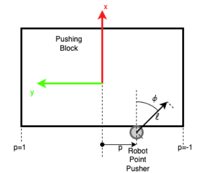
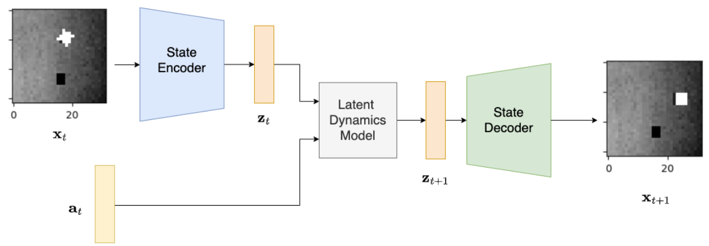
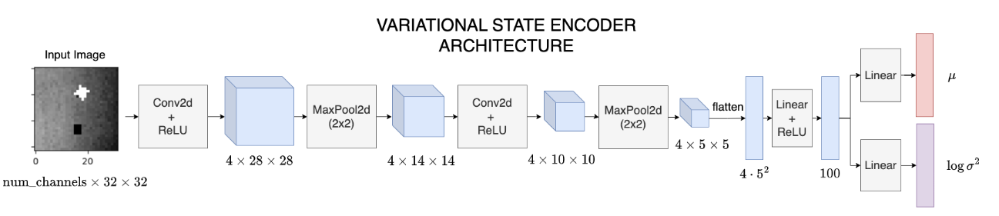

# Learning-Latent-Dynamics-for-Robotic-Pushing-Task
This is a control-from-pixel (visuomotor policy) project that utilizes a VAE (Variational Autoencoder) to perform a robotic pushing task by learning latent space dynamics.

# Planar Pushing Learning From Images

This project involves learning the dynamics of a planar pushing task directly from images.

## State Space
- The **state space** is a **32 × 32 grayscale image** captured from an **overhead camera**.  
- It encodes the block's position and orientation on a planar surface.

    

*Figure: The robot action space for the planar pushing task.*

## Action Space
The action space is parameterized as:

**u = [p, φ, ℓ]ᵀ ∈ ℝ³**, where:
1. **p ∈ [-1, 1]**: Pushing location along the block's lower edge.  
2. **φ ∈ [-π/2, π/2]**: Pushing angle relative to the block.  
3. **ℓ ∈ [0, 1]**: Pushing length, as a fraction of the max length (0.1 m).

## Overview
- The robot's pusher interacts with the block along its lower edge.
- Actions control the pushing location, direction, and distance.
- The goal is to learn the relationship between actions (**u**) and the resulting state changes.

# Learn Latent Dynamics

This part of the project involves implementing and training a dynamics model in the **latent space** of an autoencoder. The goal is to learn the temporal dynamics of a planar pushing task directly from images.

## Architecture

The architecture consists of three main components:
1. **State Encoder:** Encodes the input image (`x_t`) into a latent vector (`z_t`).
2. **Latent Dynamics Model:** Predicts the next latent state (`z_t+1`) based on the current latent state (`z_t`) and the action (`a_t`).
3. **State Decoder:** Decodes the predicted latent vector (`z_t+1`) back into the image space to reconstruct `x_t+1`.

    

*Figure: Latent dynamics architecture for learning state transitions.*

## Components Description

### State Encoder
The **State Encoder** maps the input image into a latent vector. It is a deterministic model that processes the input through several convolutional layers, followed by max-pooling and fully connected layers.

- **Input:** Grayscale image (`x_t`), 32×32 pixels, with 1 channel.
- **Output:** Latent vector (`z_t`) with dimensionality specified by `latent_dim`.

#### Encoder Architecture:
1. Conv2D (4 filters, kernel size 3×3) + ReLU → Output size: 4 × 28 × 28
2. MaxPool2D (2×2) → Output size: 4 × 14 × 14
3. Conv2D (4 filters, kernel size 3×3) + ReLU → Output size: 4 × 10 × 10
4. MaxPool2D (2×2) → Output size: 4 × 5 × 5
5. Flatten → Output size: 100 (calculated as `4 × 5 × 5`)
6. Linear + ReLU → Output size: 100
7. Linear → Latent vector (`z_t`) with size `latent_dim`.

    

*Figure: State Encoder Architecture.*

### Latent Dynamics Model
- Takes the current latent vector (`z_t`) and the action vector (`a_t`).
- Outputs the next latent vector (`z_t+1`).

### State Decoder
- Decodes the predicted latent vector (`z_t+1`) back into the image space to reconstruct the next state (`x_t+1`).

---

## Objective
- Train the system to reconstruct `x_t+1` from `x_t` and `a_t` by learning the dynamics in the latent space.
- Minimize the reconstruction loss between `x_t+1` and the decoded output.

## Training Result

    

    

---

